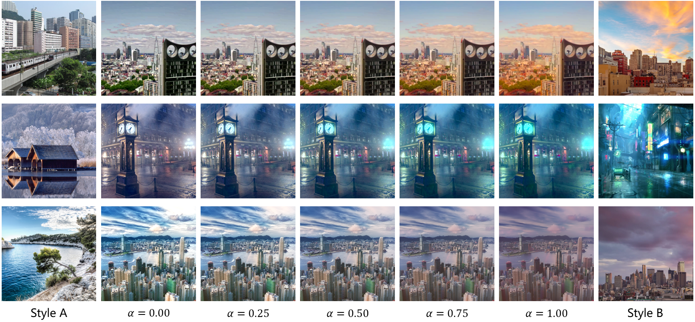
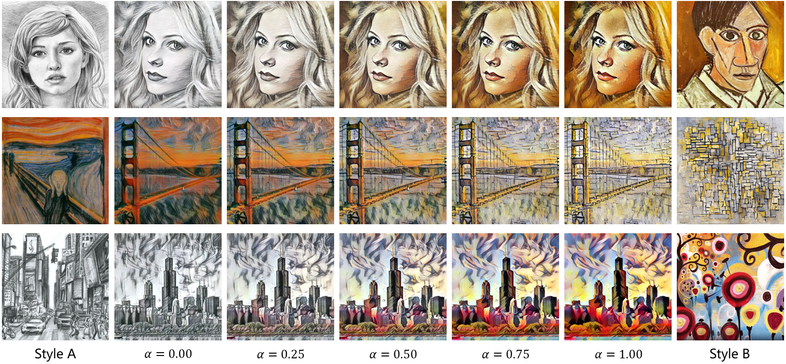

# CAP-VSTNet: Content Affinity Preserved Versatile Style Transfer (CVPR 2023)

### [**CVPR Virtual**](https://cvpr2023.thecvf.com/virtual/2023/poster/22374) | [**Paper**](https://arxiv.org/abs/2303.17867) | [**Video**](https://youtu.be/Mks9_xQNE_8)


## Usage
Three ways of using CAP-VSTNet to stylize image/video.
* Style transfer without using semantic masks.
* Style transfer with manually generated semantic masks.
* Style transfer with automatically generated semantic masks.


## Requirements
It's compatible with ```pytorch>=1.0```. An example (without using semantic segmentation model): 
```
conda install pytorch torchvision torchaudio pytorch-cuda=11.7 -c pytorch -c nvidia
pip install opencv-python scipy tqdm
``` 
If you want to transfer style with automatically generated semantic mask, an example using segmentation model [SegFormer](https://github.com/NVlabs/SegFormer) (test on Linux):
```
conda create --name capvst python=3.8 -y
conda activate capvst
pip install torch==1.8.0+cu111 torchvision==0.9.0+cu111 -f https://download.pytorch.org/whl/torch_stable.html
pip install mmcv-full==1.3.0 -f https://download.openmmlab.com/mmcv/dist/cu111/torch1.8.0/index.html
pip install timm opencv-python ipython attrs scipy

cd models/segmentation & git clone https://github.com/NVlabs/SegFormer.git
cd SegFormer && pip install -e . --user
```
Then, download the pre-trained weight ```segformer.b5.640x640.ade.160k.pth``` ([google drive](https://drive.google.com/drive/folders/1GAku0G0iR9DsBxCbfENWMJ27c5lYUeQA?usp=sharing)) and save at ```models/segmentation/SegFormer/segformer.b5.640x640.ade.160k.pth```.


## Test
Download the pre-trained weight ([google drive](https://drive.google.com/drive/folders/19xlQVprXdPJ9bhfnVEJ1ruVST-NuIlIE?usp=share_link)).

#### Image Style Transfer
```
CUDA_VISIBLE_DEVICES=0 python image_transfer.py --mode photorealistic --ckpoint checkpoints/photo_image.pt --content data/content/01.jpg  --style data/style/01.jpg
``` 
```
CUDA_VISIBLE_DEVICES=0 python image_transfer.py --mode artistic --ckpoint checkpoints/art_image.pt --content data/content/02.jpg  --style data/style/02.png
``` 

* `mode`: photorealistic or artistic.
* `ckpoint`: path for the model checkpoint.
* `content`: path for the content image.
* `style`: path for the style image.
* `auto_seg`: set `True` to use segmentation model (e.g. SegFormer).
* `content_seg` (optional): path for the manually generated content segmentation if `auto_seg=False`.
* `style_seg` (optional): path for the manually generated style segmentation if `auto_seg=False`.
* `max_size`: maximum output image size of long edge.
* `alpha_c`: interpolation between content and style if segmentation is None.

Note: Using the video model ckpoint also works. If content_seg and style_seg are provided, it's recommended to use lossless files (e.g., png) as the compression files (e.g., jpg) may have noise label.

#### Video Style Transfer
```
CUDA_VISIBLE_DEVICES=0 python video_transfer.py --mode photorealistic --ckpoint checkpoints/photo_video.pt --video data/content/03.avi  --style data/style/03.jpeg
``` 
```
CUDA_VISIBLE_DEVICES=0 python video_transfer.py --mode artistic --ckpoint checkpoints/art_video.pt --video data/content/04.avi  --style data/style/04.jpg
``` 

* `mode`: photorealistic or artistic.
* `ckpoint`: path for the model checkpoint.
* `video`: path for the input video or frame directory.
* `style`: path for the style image.
* `auto_seg`: set `True` to use segmentation model (e.g. SegFormer).
* `max_size`: maximum output video size of long edge.
* `alpha_c`: interpolation between content and style if segmentation is None.
* `fps`: video frames per second

Note: Set `--auto_seg True` to automatically generate semantic segmentation for better stylization effects. For more information on how to automatically or manually generate semantic segmentation, please refer to [here](https://github.com/NVIDIA/FastPhotoStyle/blob/master/TUTORIAL.md) (where we get inspiration and benefit a lot from).


## Train
Download the pre-trained VGG19 ([google drive](https://drive.google.com/drive/folders/19xlQVprXdPJ9bhfnVEJ1ruVST-NuIlIE?usp=share_link)) and save at ```checkpoints/vgg_normalised.pth```. 

Download dataset [MS_COCO](http://images.cocodataset.org/zips/train2014.zip) and [WikiArt](https://www.wikiart.org/).
```
/path_to_dir/img_1.jpg
/path_to_dir/img_2.png
...
/path_to_dir/sub_dirA/img_3.jpg
/path_to_dir/sub_dirB/sub_dirC/img_4.png
...
```

* Train photorealistic model
```
CUDA_VISIBLE_DEVICES=0 python train.py --mode photorealistic --train_content /path/to/COCO/directory  --train_style /path/to/COCO/directory
``` 
* Train artistic model
```
CUDA_VISIBLE_DEVICES=0 python train.py --mode artistic --train_content /path/to/COCO/directory  --train_style /path/to/WikiArt/directory --lap_weight 1 --rec_weight 1
``` 
Check log images at ```logs/XXX/index.html```. After training, you will have the checkpoints of image model and video model in ```logs/XXX/checkpoints``` directory.


## Results
### Video Style Transfer
* Photorealistic video stylization and temporal error heatmap

<div align="center">

</div>

* Artistic video stylization and temporal error heatmap

<div align="center">

</div>


### Style Interpolation
* Photorealistic style interpolation



* Artistic style interpolation




### Ultra-resolution
An example of 4K images stylization

<p align="center">

</p>


## Citation
```
@inproceedings{wen2023cap,
  title={CAP-VSTNet: Content Affinity Preserved Versatile Style Transfer},
  author={Wen, Linfeng and Gao, Chengying and Zou, Changqing},
  booktitle={Proceedings of the IEEE/CVF Conference on Computer Vision and Pattern Recognition},
  pages={18300--18309},
  year={2023}
}
```

## Acknowledgement
We thank the great work [PhotoWCT](https://github.com/NVIDIA/FastPhotoStyle/blob/master/TUTORIAL.md), [LinearWCT](https://github.com/sunshineatnoon/LinearStyleTransfer) and [ArtFlow](https://github.com/pkuanjie/ArtFlow).
